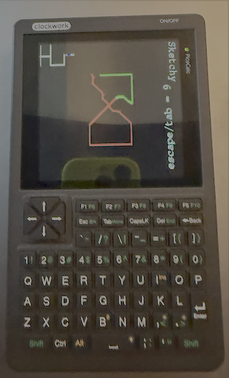

# Sketchy Drawing Toy

A simple drawing toy that lets you use the arrow keys to draw lines on the screen.

## Features

- Draw lines using the arrow keys
- Change color with ESC or TAB key
- Clear screen with DEL key
- Move cursor to top-left corner with HOME key
- Move cursor to bottom-right corner with END key

## Requirements

- TinyGo compiler
- Pico microcontroller (or compatible device)

## Usage

1. Compile the code using `tinygo build -o tinygo_sketchy.uf2 -target=pico`
2. Flash the resulting binary onto your Pico microcontroller
3. Connect to the Pico's serial console and run the program
4. Use the arrow keys to draw lines on the screen

## Contributing

Contributions are welcome! Please submit pull requests or issues through the GitHub repository.

## License

This project is licensed under the MIT License.
